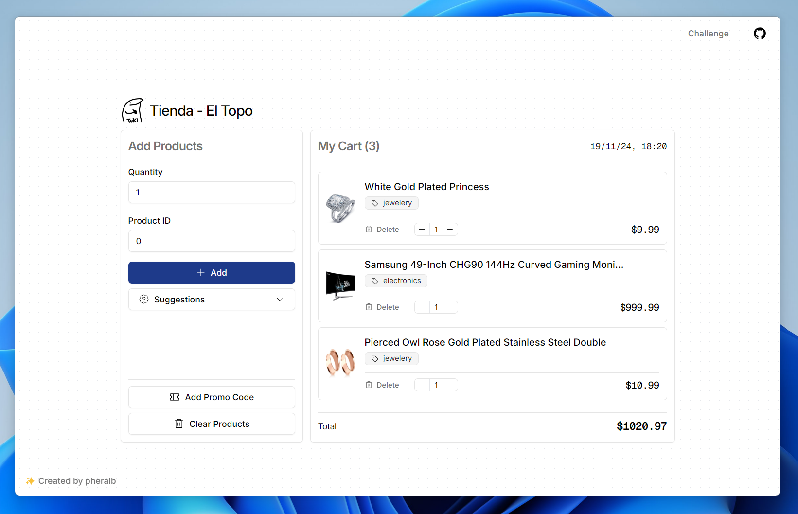

<div align="center">


<p></p>

<a href="#">Deploy</a>
<span>&nbsp;&nbsp;❖&nbsp;&nbsp;</span>
<a href="#️-challenge">Challenge</a>
<span>&nbsp;&nbsp;❖&nbsp;&nbsp;</span>
<a href="#-checklist">Checklist</a>
<span>&nbsp;&nbsp;❖&nbsp;&nbsp;</span>
<a href="#-ejecutar-el-proyecto">Ejecutar proyecto</a>


</div>

## 🛠️ Challenge

Para este desafío, nuestro cliente nos encargó hacer un carrito de compras para programadores. Tiene un formulario con 2 campos: ID del producto y cantidad. Los programadores habitualmente no necesitan saber ni ver que productos comprar, sino que saben por conexiones astrales cual es el ID del producto que quieren y así los agregan a su carrito.

Cada vez que se agrega un producto, vamos a obtener el producto desde la API y lo vamos a mostrar en una tabla, junto a la cantidad que el usuario eligió.

> Solo lo mostramos visualmente por si hay alguien que no sea programador mirando la pantalla.

## 📋 Checklist

**Requerimientos:**

- [x] Podemos agregar productos al carrito.
- [x] Manejar errores que nos devuelva la API.
- [x] Mostrar una lista con los productos agregados incluyendo `title`, `price` e `image` del producto y la `cantidad` que el usuario agregó.

**Extras:**

- [x] El carrito se persiste al recargar la página.
- [x] Mostrar el total de productos agregados.
- [x] Mostrar el costo total del carrito.
- [x] Mostrar la fecha de creación del carrito.

**Entregables:**

- [ ] Crear un Pull Request a este repositorio con tu solución.
- [ ] Reemplazar el `README.md` con instrucciones para correr el proyecto e información relevante para la evaluación.
- [ ] Incluir el link al deploy de tu aplicación.

## 🚀 Ejecutar el proyecto

1. Clonar el repositorio:

```bash
git clone git@github.com:pheralb/wallbit-challenge.git
```

2. Instalar las dependencias:

```bash
# Con pnpm (recomendado):
pnpm install

# Con npm:
npm install
```

3. Ejecutar el proyecto:

```bash
# Con pnpm (recomendado):
pnpm dev

# Con npm:
npm run dev
```

Abrir [http://localhost:5173](http://localhost:5173) para ver la aplicación.
